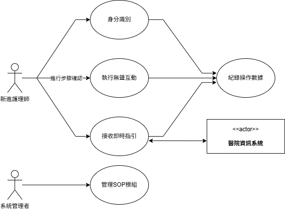

# CareSight 臨護視界系統文件

---

## 一.CareSight 臨護視界 系統需求文件

> CareSight臨護視界系統主要流程與互動概覽

本文件定義「CareSight 臨護視界」系統的功能性與非功能性需求，作為系統設計與開發的基準。

---

### 一、功能性需求 (Functional Requirements)

定義系統必須具備具體的功能與行為。

#### 1. 身分識別與登入 (Identity Verification and Login)
- 系統必須提供一個**安全的登入介面**，僅供授權的護理人員使用。  
- 護理師應能透過其醫院員工編號與密碼（或PIN碼)進行登入驗證。  
- 系統必須能根據登入者身分，從醫院資訊系統中**擷取其負責的病患列表**。

#### 2. 非侵入式即時指引顯示 (Non-intrusive Real-time Guidance Display)
- 系統必須能夠顯示與當前護理任務相關的**標準作業程序（SOP）**、病患數據與醫囑提醒。  
- 所有指引資訊必須以**半透明面板**的形式呈現在使用者視野的周邊區域（智慧儀表板），確保中央視野淨空。  
- 系統必須能透過與**醫院資訊系統NIS/HIS**的介接，即時獲取並更新病患最新資料。

#### 3. 無聲互動確認 (Silent Interaction Confirmation)
- 系統必須允許使用者透過**非語音的兩步驟流程**確認SOP步驟或介面選項：  
  (a) 使用者以**視線鎖定**（Gaze Lock）反白或高亮目標選項。  
  (b) 使用者執行一個**預設微手勢**（如「比讚轉握拳」）完成確認。  
- 系統在接收確認指令後，必須提供**明確視覺回饋**（如步驟打勾），並**自動推進至下一流程**。

---

### 二、非功能性需求 (Non-Functional Requirements)

定義系統應如何運作，包括品質、性能與限制。

#### 1. 效能 (Performance)
- 從護理師選定任務起，對應的SOP指引與病患資訊**必須在2秒內顯示**於智慧儀表板上。  
- 對於「視線鎖定」的反應延遲**必須低於500毫秒**。  
- 對於「微手勢確認」的執行與介面回饋**必須在300毫秒內完成**，確保流暢操作。

#### 2. 安全性 (Security)
- 所有病患資料的傳輸與儲存**皆須使用TLS 1.3與AES-256**等行業標準完成全程加密。  
- 採用**基於角色的存取控制（RBAC）**，確保僅授權護理師能查看負責病患資料。  
- 裝置閒置超過**5分鐘**後，系統必須**自動鎖定或登出**以防未授權存取。

#### 3. 可用性 (Usability)
- 系統介面與操作流程應允許**無MR經驗的新進護理師在30分鐘教學內學會使用**。  
- 系統運作時必須維持**60 FPS以上**之穩定畫面更新率，以避免暈眩或不適。  
- 智慧儀表板設計須符合**人因工程學原則**，其**位置、大小與透明度可個人化調整**。

#### 4. 可靠性 (Reliability)
- 核心功能（指引顯示、無聲互動）的**可用時間必須達到99.9%**，在正常輪班時間內不應發生無故閃退或功能失靈。  
- 在與醫院資訊系統短暫斷線時，系統應能**持續顯示最後快取資料**，並於連線恢復後**自動同步更新**。

---

## 二.CareSight臨護視界系統 - 使用案例說明 (Use Case Specifications)

.png)
> CareSight臨護視界系統功能架構樹狀圖

本文件記錄「CareSight臨護視界系統」（以下簡稱CareSight系統）的核心使用案例，說明系統及CareSight應用於護理現場的實際操作模式。  
**命名慣例：**  
- 系統架構、跨平台服務時使用「CareSight系統」或「系統」  
- 指MR裝置上的App/應用端時用「CareSight」  

---

### 接收即時指引 (Receive Real-time Guidance)

**唯一識別碼：** UC-001

**主要參與者：** 新進護理師 (New Nurse)  
**次要參與者：** 醫院資訊系統 (HIS/NIS)  

#### 簡要描述
新進護理師在護理操作時，透過MR裝置啟動CareSight，能於其視野側邊即時獲得與當前情境相關的關鍵照護資訊（如SOP步驟、病患生命徵象、醫囑細節等），協助其正確完成作業。

#### 前置條件 (Preconditions)
- 新進護理師已成功登入並啟動CareSight。
- MR裝置正常運作。
- CareSight已正確識別情境或任務。

#### 後置條件 (Postconditions)
- 護理師視野側邊成功顯示即時照護資訊。

#### 主要流程 (Main Flow)
1. 護理師開始執行護理任務。
2. CareSight根據環境感知或行為模式判斷所需資訊。
3. CareSight向醫院資訊系統發出讀取相關病患資料的請求（如醫囑、生命徵象）。
4. CareSight於護理師視野非中央區域（側邊）以半透明卡片形式顯示即時指引。
5. 護理師依需求瞥視或放大資訊，中央視野不受影響。

#### 替代流程 (Alternative Flows)
- **A1: 醫院資訊系統回應錯誤或超時（3a）**  
    > 註解：這裡的「3a」代表在主要流程第3步（CareSight請求醫院資訊系統資料）發生錯誤時，系統會進入本替代流程。
  - 顯示「資訊載入失敗」或「資料過時」訊息
  - 建議護理師重新載入或手動確認資訊
- **A2: 無法識別當前情境（2a）**  
    > 註解：這裡的「2a」代表在主要流程第2步（CareSight判斷當前情境）發生「無法識別」時，系統會進入本替代流程。
  - 提示護理師手動選擇當前任務或病患，並嘗試重新載入指引

#### 業務規則 (Business Rules)
- 顯示內容必須遵守醫院SOP規範
- 涉及病患隱私資訊須符合法規

#### 特殊要求 (Special Requirements)
- 顯示資訊必須高可讀、不遮擋中央視野
- 資訊需即時與醫院資訊系統同步

---

### 執行無聲互動 (Perform Silent Interaction)

**唯一識別碼：** UC-002

**主要參與者：** 新進護理師 (New Nurse)  
**次要參與者：** 無（或系統自動紀錄操作數據）

#### 簡要描述
新進護理師透過啟動於MR裝置的CareSight，以非語音、低調方式（視線鎖定與微手勢），與系統互動，用於確認操作步驟、輸入指令或推進流程，符合臨床現場安靜需求。

#### 前置條件 (Preconditions)
- CareSight顯示可互動介面元素（如步驟確認）
- 護理師已學會視線鎖定與微手勢操作

#### 後置條件 (Postconditions)
- 系統成功執行指令（如標記步驟完成）
- 操作數據自動被紀錄

#### 主要流程 (Main Flow)
1. 護理師需完成步驟或資訊確認
2. 護理師以視線鎖定CareSight介面上的互動元素
3. 執行預設微手勢（如比讚轉握拳）
4. CareSight偵測到視線加手勢組合
5. 系統執行動作（如標記完成、顯示下一步）
6. 系統紀錄操作時間與內容

#### 替代流程 (Alternative Flows)
- **A1: 手勢辨識失敗（4a）**
  > 註解：「4a」表示主要流程第4步（CareSight偵測組合）若辨識失敗就進入本替代流程。
  - 系統提示「請重新確認手勢」
  - 護理師重試
- **A2: 視線鎖定不精準（2a）**
  > 註解：「2a」表示主要流程第2步（護理師鎖定互動元素）不精準時，暫不啟動辨識。
  - 系統未啟動手勢辨識，等待正確鎖定

#### 業務規則 (Business Rules)
- 互動手勢需簡潔、不引人注目
- 系統辨識需高精度，避免誤操作

#### 特殊要求 (Special Requirements)
- 手勢操作直覺好學，且不與日常護理動作衝突
- CareSight提供清晰視覺回饋（如亮光）

---

### 管理SOP模組 (Manage SOP Modules)

**唯一識別碼：** UC-003

**主要參與者：** 系統管理者 (System Administrator)  
**次要參與者：** 無

#### 簡要描述
系統管理者透過CareSight系統之後台管理介面，得以對護理SOP模組進行新增、編輯、刪除或版本更新，以確保指引內容皆為最新且符合醫院規範。

#### 前置條件 (Preconditions)
- 管理者已登入CareSight系統管理後台
- 具備SOP模組編輯權限

#### 後置條件 (Postconditions)
- SOP模組內容已成功新增、修改或刪除，可供護理人員於CareSight前端取用

#### 主要流程 (Main Flow)
1. 系統管理者登入CareSight系統後台
2. 進入SOP模組管理介面
3. 可執行下列操作：
   - 新增SOP：輸入名稱、步驟、資料欄位、相關多媒體
   - 編輯SOP：選擇現有SOP進行內容或版本更新
   - 刪除SOP：移除不再使用SOP，或標記停用
4. 確認操作後，CareSight系統將內容變更儲存至SOP資料庫
5. 系統提供操作成功的訊息回饋

#### 替代流程 (Alternative Flows)
- **A1: 權限不足（2a）**
  > 註解：「2a」表示主要流程第2步（存取管理介面）如無權限就進入本替代流程。
  - 系統顯示「權限不足」訊息，阻擋後續操作
- **A2: 儲存失敗（4a）**
  > 註解：「4a」表示主要流程第4步（儲存變更）執行失敗時。
  - 系統提示「儲存失敗」並顯示原因，管理者可重試或取消

#### 業務規則 (Business Rules)
- SOP模組修改需有版本控制與審核機制
- 所有SOP內容均須符合醫院最新規定

#### 特殊要求 (Special Requirements)
- 管理介面需直覺易用
- SOP內容支援多媒體格式（圖片、影片）

---

**版本:** 1.0  
**文件更新日期:** 2025-10-18  
**開發團隊:** CareSight MR Project Group 第五組
